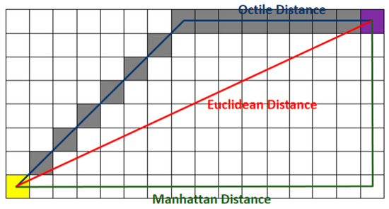
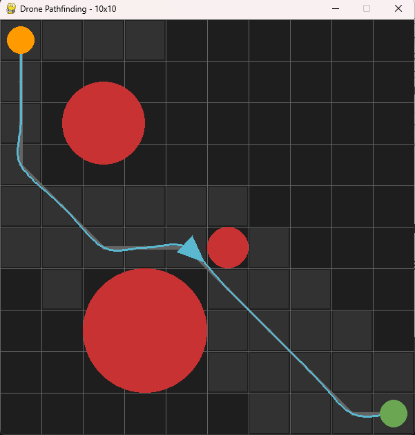
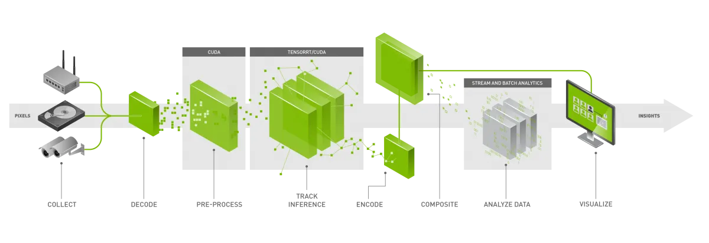

# Drone Pathfinding Simulation (A\*)

A Python-based simulation using Pygame to demonstrate A\* pathfinding for an autonomous drone navigating around circular obstacles in a discrete grid map.

## How to Run

1. Create a virtual environment: `python -m venv .venv`
2. Activate it and install dependencies: `pip install -r requirements.txt`
3. Run the simulation: `python main.py`

- 3.1 Besides the default map (easy), we developed more 3 levels: medium, hard and random. The levels goes from 10x10 scenarios with 3 obstacles, to 20x20 map with 6 obstacles in medium, to 40x40 with 9 obstacles. We also have a random map with a 40x40 maps and 15 random octacles with a random position goal. to run it, add the correspondent flag at the end: `python main.py random`.
- 3.2 To skip the animation, add the flag `--no-anim`
- 3.3 You can also choose how the heuristic for remaining distance on A\* will be calculated. You can use the default octile distance, which is useful in our limited scenario since it avoids running the square root computation used on euclidean distance(diagonal movement costs($1.414$ or $\sqrt{2}$ and cardinal movement costs 1.0). You can also change to euclidean distance by adding the flag `--heuristic euclidean` or `--heuristic octile`.
  

4. The output should produce this visual for the command `python main.py`.
   

In orange, the initial point, in green, the goal. The drone is the triangle. The lighetr gray tiles have been searched in the A\*. The blue line represents the path after the smooth path technique.

The log output should contain the trajectory, along with the waypoints after smoothing the path with the `Catmull-Rom Splines` technique. Each waypoint contains the class node attributes: position `x`, `y` and `theta angle` of the drone. along with the calculated `f`(`g`+`h`), `g`(total distance traveled) and `h` (heuristic distance) from the A\* algorithm.

```
DRONE MISSION SUMMARY
Total Tiles Explored: 36
Trajectory Steps: 13
Path Tiles: [(0, 0), (0, 1), (0, 2), (0, 3), (1, 4), (2, 5), (3, 5),
(4, 5), (5, 6), (6, 7), (7, 8), (8, 9), (9, 9)]

Drone Path Summary (37 Waypoints):
  Waypoint 0: Node(pos=(0.00, 0.00, 90.0°), f=12.726, g=0.0, h=12.726)
  Waypoint 1: Node(pos=(0.00, 0.26, 90.0°), f=12.921, g=0.333, h=12.588)
  Waypoint 2: Node(pos=(0.00, 0.63, 90.0°), f=13.116, g=0.666, h=12.45)
  ...
  Waypoint 35: Node(pos=(8.74, 9.04, -9.7°), f=14.483, g=14.15, h=0.333)
  Waypoint 36: Node(pos=(9.00, 9.00, -3.2°), f=14.484, g=14.484, h=0.0)
```

## 1. Why A\* Algorithm?

- ### Advantages
  - **A) Optimality**: guarantee to find the shortest possible path using an admissible heuristic;
  - **B) Efficiency**: the heuristic helps reducing the search space compared to random searches;
  - **C) Completeness**: if a path exists, it will be found;
  - **D) Deterministic**: the behavior will be the same in any simulation, given the same input.

- ### Limitations
  - **A) Discrete Movement**: A\* uses grid-based steps, which may need post-processing to optimize the path "flow" for drones. Eg: curves with 90° degrees;
  - **B) Static Assumption**: does not consider dynamic obstacles moving in real time, if the obstacles changes, a new path should be calculated;
  - **C) Memory Intensity**: the algorithm maintains a list of the closed and open nodes, which can be costly in high-dimentional maps(scales linearly with the number of tiles (O(N)) or with hardware limitations.
- ### Mitigation Strategies and Alternatives to Solve each Limitation
  - **A) Catmull-Rom Splines**: is a interpolating spline that guarantees the continuity of the trajectory by calculating the curve between two points considering the tangent of the two poits immediately before and after. It avoids the drone of making less efficient movements as there is no abrupt change in direction. Unlike the Bézier, the Catmull-Rom guarantee the trajectory will pass exatly on the input points (usefull to avoid obstacles). Catmull-Rom has also local control (if one point change, only this curve need to be recalculated) as oppose to Bézier global control, which needs to recalculate the whole path;
  - **B) Dynamic A\***: finds the path starting from the goal, this way ,if there is a new obstacle, calculate a new path is less costly;
  - **C) RRT\* (Rapidly-exploring Random Tree) and PSO (Particle Swarm Optimization)**: are alternative methods that works on continuous space and that uses less memory as they are both randomized. However, they do not guarantee the best path.

## 2. Next Steps for a Real Application scenario

- ### SLAM(Simultaneous Localization and Mapping)
  - **Location**: Unlike simulation, the drone in a real scenario suffers from wind or small sensor and motor drift, which makes the real position differs from the simulated one. Therefore, the location should be constanly verified with landmarks in the environment;
  - **Mapping**: In a real world scenario, the environment is dynamic and uncertain. To create a map and constanly update it, the drone must have sensors like LiDAR and Depth Cameras to construct the 3D map.

- ### PID Control (Proportional-Integral-Derivative)
  - **Role**: it acts reactively to proportionally correct the errors between the SLAM position and the real one. The integral part corrects small accumulative errors. The derivative part acts as a "damper" to control the rate of change and avoids oscilation;

- ### MPC (Model Predictive Control)
  - **Role**: can be used instead of PID. It is a mathematical model that acts proactively to predict how the drone physics will act according to the Catmull-Rom Splines we defined.

## 3. NVIDIA Jetson Orin


The hardware used in the real scenario could be a `NVIDIA Jetson Orin` as it is compact yet powered with a strong GPU (Graphics Processing Unit, which is more suitable to work with images/matrices than the CPU). The NVIDIA has the CUDA technology (Compute Unified Device Architecture), which drastically improves the GPU speed by using parallel computing techniques. TensorRT is a optimizer that compresses IA models like YOLO (eg: for object detection) to run faster on Jetson's hardware. Finally, DeepStream can orchestrate the pipeline that goes from the sensor capture, passes through the GPU and CUDA image pre-process, the the GPU and CUDA runs on the model optimized with TensorRT and the output (eg. obstacles position) is used on the pathfinder algorithm, like our A\*.

## 4. GigE Vision (Gigabit Ethernet)

For a real-world drone, we would utilize the GigE Vision standard to interface with industrial cameras. To optimize the data flow, we would enable Jumbo Frames (increasing the MTU (Maximum Transmission Unit) from 1500 to 9000), which reduces CPU overhead by minimizing the number of packet and therefore, the processing. Additionally, a Buffered architecture ensures that even during intensive A\* path recalculations, no camera frames are lost, maintaining a consistent and reliable vision pipeline for autonomous navigation.
